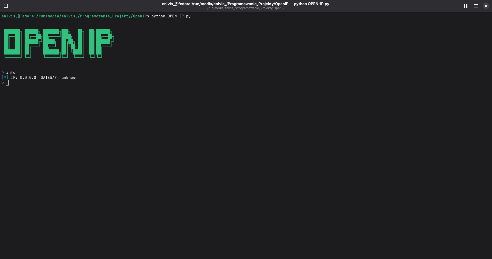
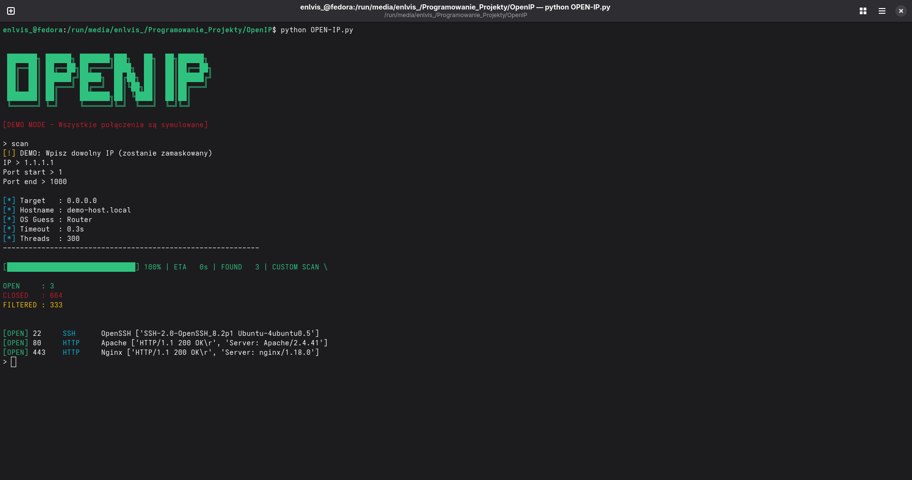
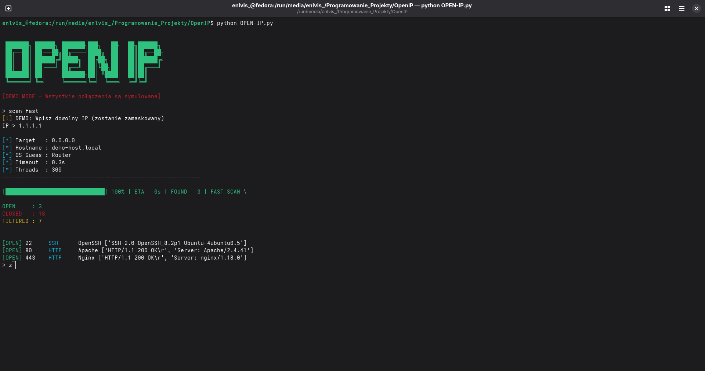
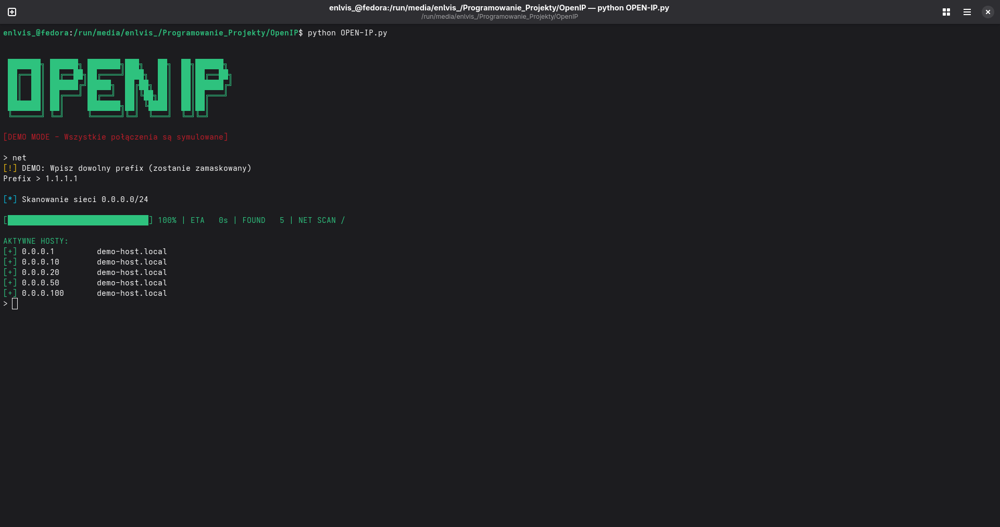

<h1 align="center">🔗 OpenIP</h1>

<div align="center">
Zaawansowane narzędzie z grupy "OpenWeb" do sprawdzania sieci prywatnych.
</div>

---

<h2 align="center">⚠️ Uwaga</h2>

**Stosuj wyłącznie na wyznaczonej lub specjalnej sieci, która jest przeznaczona dla tego typu testów.** [3]

Użycie tego narzędzia na sieciach, do których nie masz autoryzacji, może być nielegalne i wiązać się z konsekwencjami prawnymi.

---

<h2 align="center">📋 Spis treści</h2>

- [O projekcie](#-o-projekcie)
- [Wymagania](#-wymagania)
- [Instalacja](#-instalacja)
- [Użycie](#-użycie)
- [Funkcje](#-funkcje)
- [Licencja](#-licencja)

---

<h2 align="center">📖 O projekcie</h2>

OpenIP to potężne narzędzie do analizy i testowania sieci prywatnych, będące częścią pakietu "OpenWeb". Program umożliwia przeprowadzanie zaawansowanych testów bezpieczeństwa i diagnostyki sieci w kontrolowanym środowisku. [3]

---

<h2 align="center">🔧 Wymagania</h2>

- **Python 3.8+**
- System operacyjny: Windows, Linux lub macOS
- Uprawnienia administratora

---

<h2 align="center">📥 Instalacja</h2>

### 1. Instalacja Pythona

Pobierz i zainstaluj Python ze strony oficjalnej:

👉 [Python.org/downloads](https://www.python.org/downloads/) [1]

Podczas instalacji upewnij się, że zaznaczono opcję **"Add Python to PATH"**.

### 2. Weryfikacja instalacji

Sprawdź, czy Python został poprawnie zainstalowany:

```bash
python --version
```

### 3. Klonowanie repozytorium

Kliknij zielony przycisk code oraz znajdź na dole okienka przycisk **"Download .zip"**
Wypakuj plik .zip do folderu download na Windows/Linux i przenieś plik OPEN-IP.py do katalogu domowego "C://User/user"

<h2 align="center">🚀 Użycie</h2>

### Uruchomienie w terminalu

```bash
python OPEN-IP.py
```

### Przykładowe komendy

```bash
# Pomoc
help

# Skanowanie portów
scan

# Pełne skanowanie portów (Trwa kilka minut)
scan full

# Skanowanie topowych portów
skan fast

# Sprawdzanie konkretnego IP
ping

# Skan sieci ip.1-24
net

# Informacje o sieci
info
```

### PrintScreen
*Uwaga niektóre zrzuty ekranu są w wersji demo dla prywatności twórcy*









---

<h2 align="center">✨ Funkcje</h2>

- 🔍 **Skanowanie sieci** - Wykrywanie aktywnych hostów w sieci
- 🔐 **Analiza portów** - Identyfikacja otwartych portów i usług
- ⚡ **Szybkie skanowanie** - Zoptymalizowane algorytmy

---

<h2 align="center">📄 Licencja</h2>

Ten projekt jest udostępniony bez licencji.

---

<div align="center">
   <p>Stworzone z ❤️ przez Enlvis</p>
   <p>⭐ Jeśli podoba Ci się projekt, zostaw gwiazdkę na GitHubie! ⭐</p>
</div>

